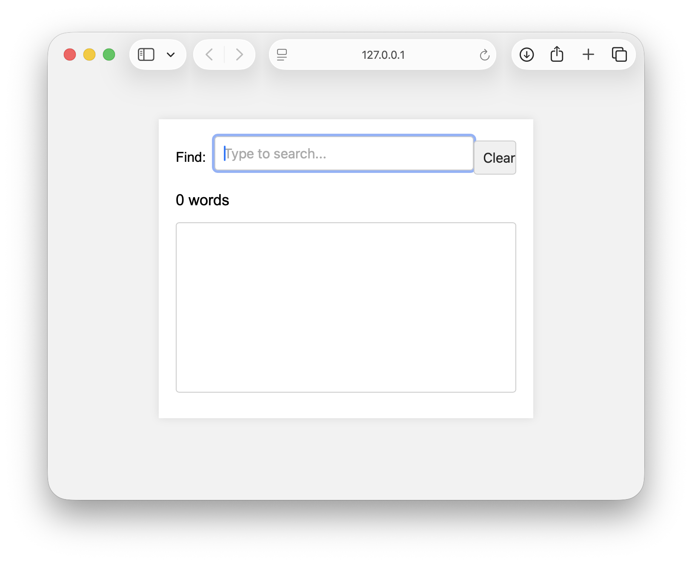

# Word Finder

An interactive word search application built with HTML, CSS, JavaScript, JSON data, and jQuery.

This project allows users to search through a dictionary dataset and dynamically retrieve matching words through a browser-based interface. The application focuses on user interaction, data processing, and efficient search functionality.

## Preview

<p align="center">
  
</p>

---

## Overview

Word Finder is a browser-based application designed to help users search and explore words from a structured dictionary dataset. The application loads word data from JSON files and dynamically filters results based on user input.

The project was created to explore JavaScript programming concepts including data manipulation, event handling, JSON processing, and dynamic user interface updates.

---

## Built With

- HTML5
- CSS3
- JavaScript
- jQuery
- JSON

---

## Features

- Dynamic word searching
- Real-time filtering
- JSON-based data storage
- Interactive user interface
- Search result generation
- Browser-based functionality
- Lightweight application architecture

---

## Skills Demonstrated

- JavaScript Programming
- JSON Data Processing
- jQuery Development
- Front-End Development
- Event Handling
- DOM Manipulation
- Data Filtering
- User Interface Design
- Problem Solving
- Interactive Application Development

---

## Project Structure

```text
word-finder/
├── word-finder.html
├── dictionary.js
├── words-small.json
├── words-large.json
├── jquery-1.5.min.js
├── screenshots/
├── README.md
├── LICENSE
└── .gitignore
```

## How It Works

The application loads a dictionary dataset from JSON files and allows users to search for words through an interactive interface. As users enter search criteria, JavaScript dynamically processes the data and updates the displayed results.

Key concepts demonstrated include:

- Data retrieval from JSON files
- Dynamic filtering of large datasets
- User-driven search functionality
- Real-time interface updates

---

## Learning Outcomes

Through this project, I gained experience with:

- Working with structured JSON datasets
- Implementing dynamic search functionality
- Processing and filtering user input
- Managing front-end application logic
- Building interactive web applications
- Creating responsive user experiences
- Using jQuery to simplify DOM interactions

---

## How to Run

1. Clone the repository.

```bash
git clone https://github.com/Zaanie10/word-finder.git
```

2. Navigate to the project directory.

```bash
cd word-finder
```

3. Open `word-finder.html` in your preferred web browser.

No installation or additional dependencies are required.

---

## Future Improvements

- Add advanced filtering options
- Implement autocomplete suggestions
- Improve search performance for larger datasets
- Add word definitions and metadata
- Enhance mobile responsiveness
- Modernize the interface design
- Replace legacy jQuery with modern JavaScript

---

## Course Information

**Course:** CS 4712 – User Interface Engineering  
**Institution:** Kennesaw State University

---

## Author

**Zaanie Bowen**

- Portfolio: https://zaaniebowen.dev
- GitHub: https://github.com/Zaanie10
- LinkedIn: https://www.linkedin.com/in/melezaan-bowen-1bb690200/

---

*This project was completed as part of my Software Engineering coursework and demonstrates front-end development, JSON data processing, search functionality, and interactive web application design.*
